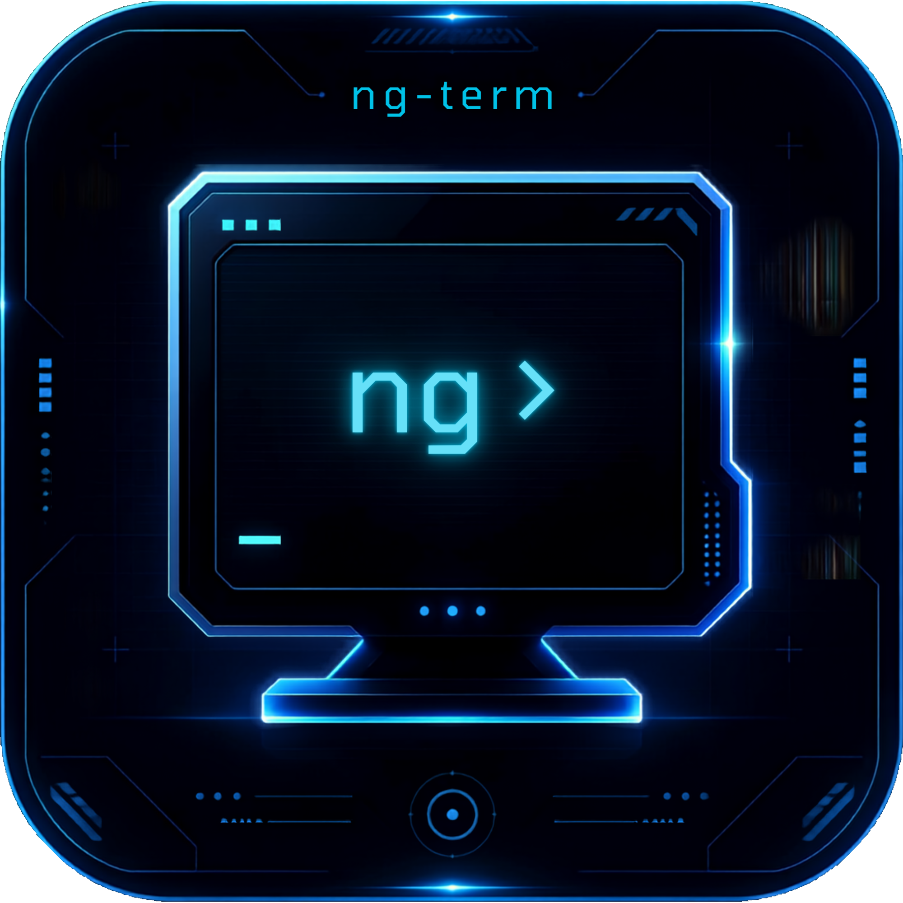

<p align="center">
  
</p>

# nacelle-desktop

> **THIS PROJECT IS NOT A CLONE OF eDEX-UI. IT IS AN INDEPENDENT PROJECT INSPIRED BY eDEX-UI.**
>
> **THIS PROJECT WAS WRITTEN ENTIRELY BY ANTHROPIC'S CLAUDE AI MODELS.**
>
> **THE LOGO WAS ALSO AI-GENERATED, USING CANVA.**

## Three repositories

The program is one of three parts, each installed and upgraded on its
own. nacelle-desktop generates nothing and carries nothing: it draws
whatever it finds installed, and what is not installed is simply not
offered.

| repository | what it installs |
|---|---|
| **nacelle-desktop** | the program: binary, fonts, icon, desktop entry |
| [nacelle-widgets](https://github.com/JOCKER3201/nacelle-widgets) | the widgets — Rhai scripts and compiled `.so` plugins |
| [nacelle-themes](https://github.com/JOCKER3201/nacelle-themes) | looks, styles, sound themes, layouts and the default configuration |

Everything is read from three directories, searched in this order:

    ~/.local/share/nacelle-desktop      your own
    /usr/local/share/nacelle-desktop    sudo make install
    /usr/share/nacelle-desktop          a distribution package

The first copy of a given name wins, so anything you install for
yourself shadows a packaged one without either being touched — and
without needing root to change a theme.

## Widgets

A widget is one directory holding one file: a **Rhai script**
(`<name>.rhai`) or a **compiled plugin** (`<name>.so`). The directory
name is the widget's name and is what ties it to a place in a layout.
Adding a widget means adding a directory; there is no list to register
it in.

Scripts are the ordinary way to write one. They are sandboxed by
construction — a script sees the host data and the drawing vocabulary
and nothing else, so it cannot read a file, open a socket or start a
process — they survive upgrades untouched, and one script works on every
platform.

Compiled plugins exist for the few widgets a script cannot express: the
terminal view, which draws thousands of character cells per frame, and
the file browser, which has to read directories. They are the escape
hatch, not the default.

> ### This warning is about `.so` plugins only
>
> **None of it applies to `.rhai` scripts.** A script cannot reach the
> filesystem, the network or another process, because no function that
> would let it exists in its world. Installing a script risks nothing
> but a badly drawn panel.
>
> **A compiled plugin is the opposite: native code running with your
> full account privileges, in a program that sits next to your shell.**
> There is no sandbox around it, and none is possible. Installing one is
> the same act of trust as building a package from the AUR or adding a
> third-party repository — judge the author, not the mechanism.
>
> A plugin must also be rebuilt for each release, and separately for
> each platform and processor architecture; a script is written once and
> works everywhere, on every version. Plugins shipped with nacelle-desktop are
> overwritten on every install, so an outdated one cannot linger;
> plugins you add yourself are left alone.
>
> Prefer a script. Reach for a plugin only when a script genuinely
> cannot do the job.

`NACELLE_SAFE=1` starts the program with every plugin skipped, which is
the way back in when one of them prevents startup.

`NACELLE_MOOD=lockdown` starts in one of the theme's moods and holds it
there. A mood is the same interface re-skinned — the theme's alarm or
lockdown colours — and the theme's own rules normally raise it from the
telemetry; naming one here is the host taking that decision by hand, and
nothing the machine reports puts it down again.

**Ctrl+Shift+M** does the same while the program is running: each press
takes the next mood the theme declares, and one more press hands the
screen back to the theme's own rules. A mood change announces itself with
a single full-screen tint that fades over a quarter of a second — without
it a re-skin looks like a drawing fault rather than an alarm.

## Installation

Requirements: Linux, a Vulkan driver, Rust (cargo), GNU make.

```sh
make install        # clean build + install to ~/.local/
sudo make install   # clean build + install to /usr/local/
```

That installs the program alone. For a working interface, install the
widgets and the default theme set as well — each has the same two
commands:

```sh
git clone https://github.com/JOCKER3201/nacelle-widgets && (cd nacelle-widgets && make install)
git clone https://github.com/JOCKER3201/nacelle-themes  && (cd nacelle-themes  && make install)
```

Then run:

```sh
nacelle-desktop
```

Uninstall:

```sh
make uninstall        # if installed to ~/.local/
sudo make uninstall   # if installed to /usr/local/
```

This removes the program only. The widgets and themes have their own
`make uninstall`, and neither touches anything you edited.
